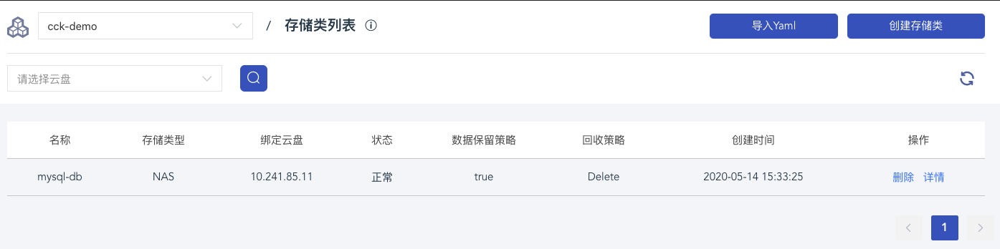

# 高可用WordPress集群Kubernetes配置实例 - CCK

## 背景
- WordPress是一个以PHP和MySQL为平台的自由开源的博客软件和内容管理系统
- 截止2019年4月，WordPress已被超过6000万个网站使用，前1000万流行网站中WordPress使用率高达33.6%

## 架构
### 单一实例


如图所示，这种简单架构适合学习测试，通过docker命令直接运行容器，可以很方便的建立销毁实例，但用于实际生产环境，缺存在着单点故障和性能的隐患。

### 高可用架构


在这个架构方案下，我们首先建立了一个mysql应用，为WordPress提供一个高可用的数据库。
然后再建立一个WordPress应用，他们之间共享/var/www/html, 这个目录存储了WordPress的静态资源，以便当用户的图片等资源上传到服务器时，
可以被所有的WordPress实例所共享。 最后，我们在WordPress应用前，再加上负载均衡服务，这样就组成了一个高可用的集群方案

###解决方案
下图描述了高可用架构在K8S实际的部署模型

首先，我们需要创建一个MySQL的应用，由于数据库属于有状态服务，所以这里我们用StatefulSet去管理MySQL的实例.
对于每个MySQL的pod，我们通过storageclass，在CDS提供的文件存储服务上，单独配置一个持久化存储。
在配置MySQL时，我们可以通过xtrabackup插件，实现数据库的主从配置。之后我们再为MySQL单独配置两个Service，分别提供读访问和写访问的连接。

当有了MySQL之后，我们可以继续配置WordPress应用。由于WordPress是无状态服务，我们可以简单的部署为Deployment。 
这里需要注意的是，当WordPress去连接MySQL应用时，我们通过`HyperDB`插件，分离出WordPress的读写操作，
使得所有的读操作可以通过MySQL的只读Service连接到数据的所有节点上，而写操作只能发送到MySQL的master节点上。
此外，我们还创建了一个共性存储空间，用于所有WordPress实例间共享静态资源。

当WordPress和MySQL部署完成后，我们只需再配置下出网的路由，即可完成整个高可用WordPress的部署

## 操作
### 一. 创建首云K8S集群
通过首云创建K8S，可以通过下列方式简单点击鼠标创建：https://console.capitalonline.net/cluster_k8s


### 二. 创建文件存储
当集群创建完成后，我们可以对其创建文件存储


当NAS存储创建完成后，需要挂载到对应的K8S集群才可使用


当挂载完成后，私网IP即为后面文件存储需要用到的IP地址

### 三. 创建名字空间
创建一个新的名字空间`wordpress`, 我们会把所有的用到的资源全部建在这个名字空间下
```yaml
apiVersion: v1
kind: Namespace
metadata:
  name: wordpress
```

可以在任意资源创建页面上，通过右上的`导入yaml功能`来创建 来创建


### 四. 配置MySQL服务
创建两个MySQL的服务：`mysql`和`mysql-read`：
- `mysql` 是一个无头服务，这样我们就可以用`mysql-0.mysql`作为名字来访问MySQL数据库中的master节点，以便执行写操作

- `mysql-read`是一个`ClusterIP`类型的服务，我们可以通过`mysql-read`名字来轮询访问所有MySQL的节点，以便执行读操作

这样，通过`mysql-0.mysql`和`mysql-read`两个服务名字，我们就可以把读写操作的访问地址区分开来
```yaml
apiVersion: v1
kind: Service
metadata:
  name: mysql
  labels:
    app: mysql
  namespace: wordpress
spec:
  ports:
  - name: mysql
    port: 3306
  clusterIP: None
  selector:
    app: mysql
```

```yaml
apiVersion: v1
kind: Service
metadata:
  name: mysql-read
  labels:
    app: mysql
  namespace: wordpress
spec:
  ports:
  - name: mysql
    port: 3306
  selector:
    app: mysql
```

我们可以在页面上查看相应的服务已创建:

### 五. 添加MySQL的配置文件
这里我们配置了一个configmap的资源，用于存储MySQL的master和slave节点的配置，后面会在创建MySQL集群的时候引用
```yaml
apiVersion: v1
kind: ConfigMap
metadata:
  namespace: wordpress
  name: mysql
  labels:
    app: mysql
data:
  master.cnf: |
    # Apply this config only on the master.
    [mysqld]
    log-bin
  slave.cnf: |
    # Apply this config only on slaves.
    [mysqld]
    super-read-only
```

### 六. 配置MySQL的存储类
在正式创建MySQL集群前，我们还要配置存储类，以便每个MySQL的实例，可以自定义的去使用首云提供的文件存储作为持久卷

```yaml
apiVersion: storage.k8s.io/v1
kind: StorageClass
metadata:
  name: mysql-db
provisioner: nas.csi.cds.net
reclaimPolicy: Delete
parameters:
  server: 10.241.85.11  #需要根据真实的NAS挂载IP进行修改
  path: /nfsshare
  vers: "4.1"
  archiveOnDelete: "true"
  options: noresvport
```
我们可以在网页上看到存储类已经正确配置


### 七. 创建MySQL集群
终于，我们可以开始创建MySQL集群了，MySQL集群是一个Stateful Set类型的资源，默认的副本数是`3`个Pod。

在每个Pod中，会有两个初始化容器：
 - `init-mysql`: 这个初始化容器是自动为MySQL的master和slave的节点生成配置文件，这里会读取我们第五步配置的configmap.
 - `clone-mysql`: 当集群扩容时，新的MySQL slave会自动克隆前一个实例的内容，这样保证了新的slave启动时，内容和现有数据库的内容一致
 
此外，每个Pod中，还有两个主容器：
 - `mysql`: 每个MySQL实例的主容器，对外提供服务
 - `xtrabackup`: 一个sidecar容器，用于同步slave节点间的内容，保证数据一致性
我们这里通过第六步设置的storageclass，为每个pod都分配了一个PV，用于持久存储MySQL的data。这样如果一个Pod失败被调度到其他地方，我们可以保证数据不会丢失

```yaml
apiVersion: apps/v1
kind: StatefulSet
metadata:
  name: mysql
  namespace: wordpress
spec:
  selector:
    matchLabels:
      app: mysql
  serviceName: mysql
  replicas: 3
  template:
    metadata:
      labels:
        app: mysql
    spec:
      initContainers:
      - name: init-mysql
        image: registry-bj.capitalonline.net/cck-example/mysql:5.7
        command:
        - bash
        - "-c"
        - |
          set -ex
          # Generate mysql server-id from pod ordinal index.
          [[ `hostname` =~ -([0-9]+)$ ]] || exit 1
          ordinal=${BASH_REMATCH[1]}
          echo [mysqld] > /mnt/conf.d/server-id.cnf
          # Add an offset to avoid reserved server-id=0 value.
          echo server-id=$((100 + $ordinal)) >> /mnt/conf.d/server-id.cnf
          # Copy appropriate conf.d files from config-map to emptyDir.
          if [[ $ordinal -eq 0 ]]; then
            cp /mnt/config-map/master.cnf /mnt/conf.d/
          else
            cp /mnt/config-map/slave.cnf /mnt/conf.d/
          fi
        volumeMounts:
        - name: conf
          mountPath: /mnt/conf.d
        - name: config-map
          mountPath: /mnt/config-map
      - name: clone-mysql
        image: registry-bj.capitalonline.net/cck-example/xtrabackup:1.0
        command:
        - bash
        - "-c"
        - |
          set -ex
          # Skip the clone if data already exists.
          [[ -d /var/lib/mysql/mysql ]] && exit 0
          # Skip the clone on master (ordinal index 0).
          [[ `hostname` =~ -([0-9]+)$ ]] || exit 1
          ordinal=${BASH_REMATCH[1]}
          [[ $ordinal -eq 0 ]] && exit 0
          # Clone data from previous peer.
          ncat --recv-only mysql-$(($ordinal-1)).mysql 3307 | xbstream -x -C /var/lib/mysql
          # Prepare the backup.
          xtrabackup --prepare --target-dir=/var/lib/mysql
        volumeMounts:
        - name: data
          mountPath: /var/lib/mysql
          subPath: mysql
        - name: conf
          mountPath: /etc/mysql/conf.d
      containers:
      - name: mysql
        image: registry-bj.capitalonline.net/cck-example/mysql:5.7
        env:
        - name: MYSQL_ALLOW_EMPTY_PASSWORD
          value: "1"
        ports:
        - name: mysql
          containerPort: 3306
        volumeMounts:
        - name: data
          mountPath: /var/lib/mysql
          subPath: mysql
        - name: conf
          mountPath: /etc/mysql/conf.d
        resources:
          requests:
            cpu: 500m
            memory: 1Gi
        livenessProbe:
          exec:
            command: ["mysqladmin", "ping"]
          initialDelaySeconds: 30
          periodSeconds: 10
          timeoutSeconds: 5
        readinessProbe:
          exec:
            # Check we can execute queries over TCP (skip-networking is off).
            command: ["mysql", "-h", "127.0.0.1", "-e", "SELECT 1"]
          initialDelaySeconds: 5
          periodSeconds: 2
          timeoutSeconds: 1
      - name: xtrabackup
        image: registry-bj.capitalonline.net/cck-example/xtrabackup:1.0
        ports:
        - name: xtrabackup
          containerPort: 3307
        command:
        - bash
        - "-c"
        - |
          set -ex
          cd /var/lib/mysql

          # Determine binlog position of cloned data, if any.
          if [[ -f xtrabackup_slave_info && "x$(<xtrabackup_slave_info)" != "x" ]]; then
            # XtraBackup already generated a partial "CHANGE MASTER TO" query
            # because we're cloning from an existing slave. (Need to remove the tailing semicolon!)
            cat xtrabackup_slave_info | sed -E 's/;$//g' > change_master_to.sql.in
            # Ignore xtrabackup_binlog_info in this case (it's useless).
            rm -f xtrabackup_slave_info xtrabackup_binlog_info
          elif [[ -f xtrabackup_binlog_info ]]; then
            # We're cloning directly from master. Parse binlog position.
            [[ `cat xtrabackup_binlog_info` =~ ^(.*?)[[:space:]]+(.*?)$ ]] || exit 1
            rm -f xtrabackup_binlog_info xtrabackup_slave_info
            echo "CHANGE MASTER TO MASTER_LOG_FILE='${BASH_REMATCH[1]}',\
                  MASTER_LOG_POS=${BASH_REMATCH[2]}" > change_master_to.sql.in
          fi

          # Check if we need to complete a clone by starting replication.
          if [[ -f change_master_to.sql.in ]]; then
            echo "Waiting for mysqld to be ready (accepting connections)"
            until mysql -h 127.0.0.1 -e "SELECT 1"; do sleep 1; done

            echo "Initializing replication from clone position"
            mysql -h 127.0.0.1 \
                  -e "$(<change_master_to.sql.in), \
                          MASTER_HOST='mysql-0.mysql', \
                          MASTER_USER='root', \
                          MASTER_PASSWORD='', \
                          MASTER_CONNECT_RETRY=10; \
                        START SLAVE;" || exit 1
            # In case of container restart, attempt this at-most-once.
            mv change_master_to.sql.in change_master_to.sql.orig
          fi

          # Start a server to send backups when requested by peers.
          exec ncat --listen --keep-open --send-only --max-conns=1 3307 -c \
            "xtrabackup --backup --slave-info --stream=xbstream --host=127.0.0.1 --user=root"
        volumeMounts:
        - name: data
          mountPath: /var/lib/mysql
          subPath: mysql
        - name: conf
          mountPath: /etc/mysql/conf.d
        resources:
          requests:
            cpu: 100m
            memory: 100Mi
      volumes:
      - name: conf
        emptyDir: {}
      - name: config-map
        configMap:
          name: mysql
  volumeClaimTemplates:
  - metadata:
      name: data
    spec:
      accessModes: ["ReadWriteOnce"]
      resources:
        requests:
          storage: 10Gi
      storageClassName: mysql-db
```

之后我们可以在页面上看到资源被正确创建：

有状态：


存储声明:


存储类:


### 八. 配置WordPress存储
当MySQL应用配置完成后，我们可以开始WordPress的配置，这里我们先为WordPress配置pvc和pv，用于共享所有WordPress Pod之间的静态文件
```yaml
apiVersion: v1
kind: PersistentVolumeClaim
metadata:
  name: wordpress-data
  namespace: wordpress
spec:
  accessModes:
    - ReadWriteMany
  storageClassName: ""
  resources:
    requests:
      storage: 100Gi
```

```yaml
apiVersion: v1
kind: PersistentVolume
metadata:
  name: wordpress-data
spec:
  capacity:
    storage: 100Gi
  accessModes:
    - ReadWriteMany
  persistentVolumeReclaimPolicy: Retain
  csi:
    driver: nas.csi.cds.net
    volumeHandle: wordpress-data
    volumeAttributes:
      server: "10.241.85.11" #需要手动修改为真是的NAS挂载地址
      path: "/nfsshare/wordpress-data"
      vers: "4.0"
```
之后我们可以在页面上验证对应的持久卷声明和持久卷已经正确创建：


### 九. 创建WordPress应用
接下来我们可以开始创建WordPress应用了。这是个无状态服务，我们只需要创建一个Deployment类型的资源即可。
这里我们每个Pod都会引用相同的PVC，这样会使得每个Pod共享存储。这与MySQL是不同的，MySQL中是每个Pod独享存储，然后通过sidecar保持数据的一致性

```yaml
apiVersion: apps/v1
kind: Deployment
metadata:
  name: wordpress
  namespace: wordpress
  labels:
    app: wordpress
spec:
  selector:
    matchLabels:
      app: wordpress
      tier: frontend
  strategy:
    type: Recreate
  replicas: 3
  template:
    metadata:
      labels:
        app: wordpress
        tier: frontend
    spec:
      containers:
      - image: registry-bj.capitalonline.net/cck-example/wordpress:hyperdb
        name: wordpress
        env:
        - name: WORDPRESS_DB_HOST
          value: mysql-0.mysql
        - name: REPLICA_DB_HOST
          value: mysql-read
        ports:
        - containerPort: 80
          name: wordpress
        volumeMounts:
        - name: wordpress-persistent-storage
          mountPath: /var/www/html
      volumes:
      - name: wordpress-persistent-storage
        persistentVolumeClaim:
          claimName: wordpress-data
```
之后我们可以在页面上看到该无状态服务已经成功部署：


### 十. 配置WordPress服务
接下来，我们给WordPress应用配置一个ClusterIP类型的服务，用于做负载均衡
```yaml
apiVersion: v1
kind: Service
metadata:
  labels:
    app: wordpress
  name: wordpress
  namespace: wordpress
spec:
  clusterIP: 10.96.30.168
  ports:
  - name: wordpress
    port: 80
    protocol: TCP
    targetPort: 80
  selector:
    app: wordpress
    tier: frontend
  sessionAffinity: None
  type: ClusterIP
```
之后可以在页面查看到服务已经正确创建：


### 十一. 配置WordPress路由
最后，我们配置下Ingress路由。这里host是我们需要访问WordPress的HostName，`serviceName`对应于我们上一步创建的WordPress服务
```yaml
apiVersion: extensions/v1beta1
kind: Ingress
metadata:
  name: wordpress
  namespace: wordpress
spec:
  rules:
  - host: word.press
    http:
      paths:
      - backend:
          serviceName: wordpress
          servicePort: 80
```
！[ingress](./public/ingress.png)
可以通过页面确认Ingress路由已经创建完成

### 十二. 完成
我们可以在页面上查看到集群的IP


本机配置域名解析
`sudo echo "103.228.160.68 word.press" >> /etc/hosts`

之后就可以正常访问高可用的WordPress集群了


## 资源
所有yaml文件均可在 `yaml`文件夹下找到，我们可以手动一步步的按上述说明手动执行。

同时，`all-in-one.yaml` 包含了所有的资源，我们也可以一次性的执行这个文件，所有的资源会自动创建出来

**注意**: `all-in-one.yaml`，`mysql-storageclass.yaml` 和 `wordpress-pv.yaml`中的NAS `server`的值，需要根据实际情况修改该

